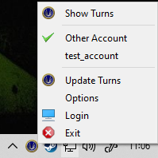
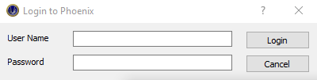
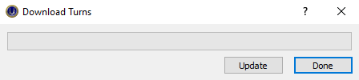

<h1>Phoenix Turn Downloader</h1>

Turn downloader for Phoenix: Beyond the Stellar Empire (www.phoenixbse.com) . 
All suggestions werlcome - pop them in issues.

<h2>Download and Setup</h2>

[Downloader the most up-to-date version here](https://github.com/DrDarak/phoenix_turns/releases)

Your broswer will tell you not to download the file - you need to override that. 
When you have the exe in your download directory - double click it and agree to allow it to run. 
If you are running windows defender it will try to tell you it's a trojan, ignore the 
warning by opening more information and agree to run the app.

When the downloader is installed it will create a short cut on your desktop and run a app in your task bar as shown below:

You can then login (with phoenix nexus login) to create account on you local machine (it does not store your password)

And then pressing Update Turns on task bar menu and it spawns a Download turns dialog - press update and it will get all your current turns. This may take a while.

Pressing Show turns spawns a browser window to show your turns.

<h2>Uninstalling</h2>
If you want to uninstall the software then go to your add/remove programs and uninsall. Uninstall will not remove your turns that has to be removed manually from 

<h2>Stored Data</h2>
Data for the app is stored in (type into explorer): 
%LocalAppData%/phoenix_turns
<pre>
phoenix_turns---config.json  <-- used for online xml codes and other config
              |-index.html   <-- file used to display your turns
              |-log.txt      <-- log file with every request to www.phoenixbse.com
              |-phoenix.db   <-- sqlite db with all turns data stored
              |-main.css
              |-tree.css     <-- css files with corrected colours for current colour in use
              |-Turns.css
              |-images       <-- directory with all images for index.html
              |-positions-|-User 0            <-- directory of all users that have been llogged in
                          |-User 1-|-days    <-- in each user there is a directory for each day where turnser were downlaoded
 </pre>                         

<h2>Requirements to Build</h2>
<ul>
<li>Python 3.9 (not 10 so QT5tools work)
<li>pip install requests
<li>pip install pyqt5
<li>pip install pyinstaller
<li>pip install cx_Freeze
<li>NullScript Scriptable Install System (NSIS)
</ul>

<h2>Release Method</h2>
<ul>
<li> Change version numbers in setup.py / setup.nis
<li> run: python setup.py build_exe
<li> drop: setup.nis into NSIS app
</ul>
 
